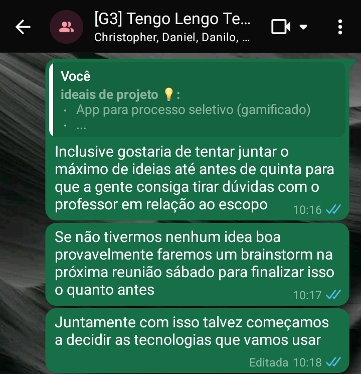
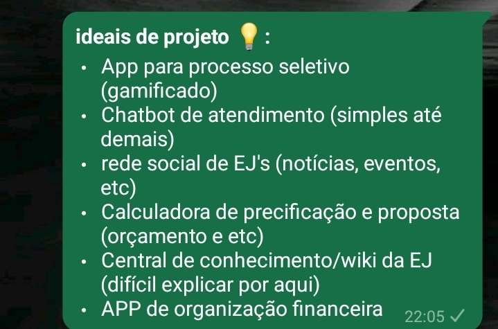
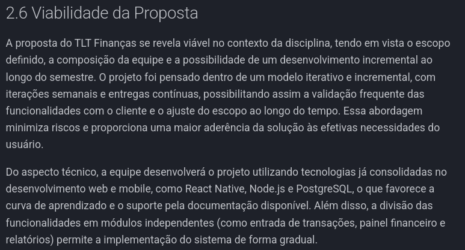
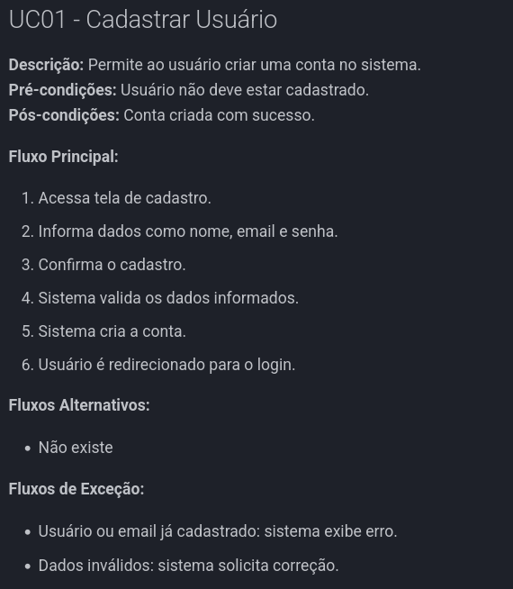

# Iteração 1

**OBS.:** Devido a natureza da materia as iterações 1 e 2 não possuem reuniões gravadas, pois só fomos informados da necessidade de evidencias a partir da unidade 2 (23/04/26).

## Brainstorm

- Feito, mas não possui evidencias em video

## Entrevista

- Feito, mas não possui evidencias

## Análise de Viabilidade

[Analise completa](../../visao/2-solucao.md#26-viabilidade)

## Análise de custo/Benefício

<iframe width="100%" height="500" src="https://miro.com/app/board/uXjVHTBwhKE=/?share_link_id=623549294839" title="Matriz de impacto e esforçp" frameborder="0" allow="accelerometer; autoplay; clipboard-write; encrypted-media; gyroscope; picture-in-picture; web-share" allowfullscreen></iframe>
[Matriz de valor e impacto](https://miro.com/app/board/uXjVHTBwhKE=/?share_link_id=623549294839)

### Validação com a equipe

[Assista à reunião com a equipe](https://youtu.be/-AwFMe3b6LM)

### Validação com o cliente

[Assista à reunião com o cliente](https://youtu.be/gUeZrQ4ptOU)

## Casos de Uso

[Lista de UCs](../../visao/8-casosdeuso/index.md)

## Avaliação da Iteração

- Feito, mas não possui evidencias

## Construção da Work Item List

[Work Item List](../../visao/11-WIL-produto.md)

