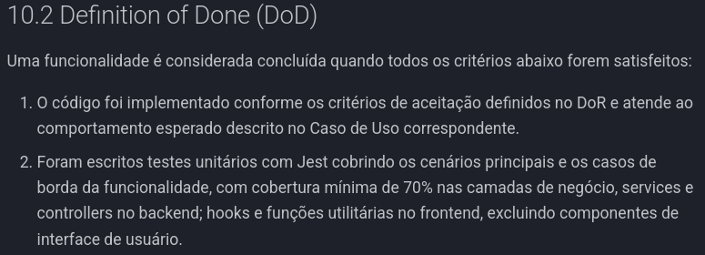
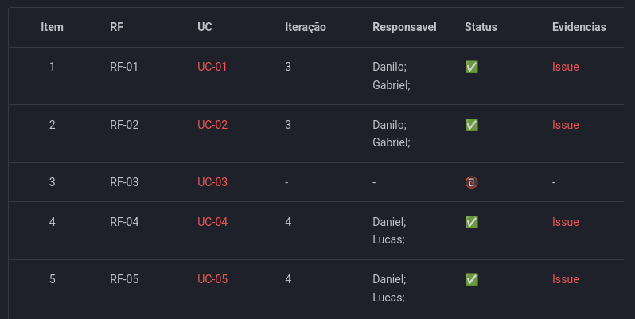

# Iteração 3

## Protótipos

<iframe style="border: 1px solid rgba(0, 0, 0, 0.1);" width="800" height="450" src="https://embed.figma.com/design/JC2E9URvqIjq9ij86enkhi/TLT-finan%C3%A7as?node-id=0-1&embed-host=share" allowfullscreen></iframe>
[Prototipo no Figma](https://www.figma.com/design/JC2E9URvqIjq9ij86enkhi/TLT-finan%C3%A7as?node-id=0-1&t=vTUh4DcEfVZJtuQC-1)

## Avaliação da Iteração

<iframe
  width="100%"
  height="500"
  src="https://www.youtube.com/embed/R4eEKjoUIPA"
  title="Reunião 25/04/26 - Equipe"
  frameborder="0"
  allow="accelerometer; autoplay; clipboard-write; encrypted-media; gyroscope; picture-in-picture; web-share"
  allowfullscreen>
</iframe>

[Assista à reunião com a equipe](https://youtu.be/R4eEKjoUIPA)

## Feedback do cliente

<iframe
  width="100%"
  height="500"
  src="https://www.youtube.com/embed/5xAxyaaIrFA"
  title="Reunião 25/04/26 - Cliente"
  frameborder="0"
  allow="accelerometer; autoplay; clipboard-write; encrypted-media; gyroscope; picture-in-picture; web-share"
  allowfullscreen>
</iframe>

[Assista à reunião com o cliente](https://youtu.be/5xAxyaaIrFA)

## Definition of Done (DoD)

[DOD](../../visao/10-DoR-e-DoD.md#DOD)

## Refinamento da Work Item List

[Work Item List](../../visao/11-WIL-produto.md)