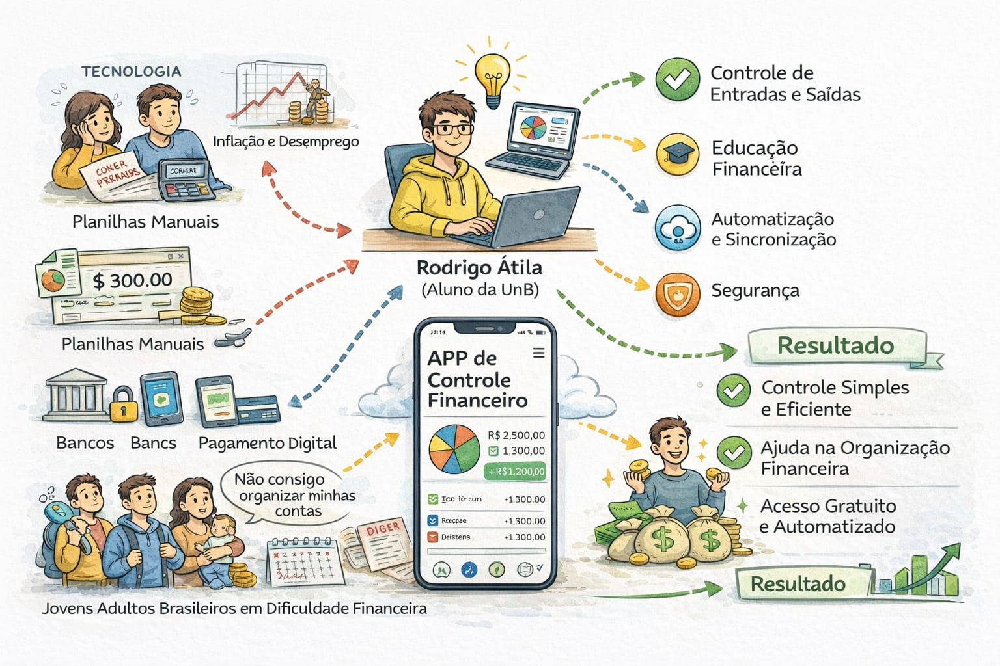
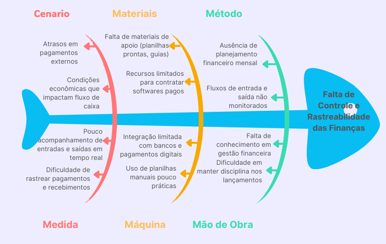
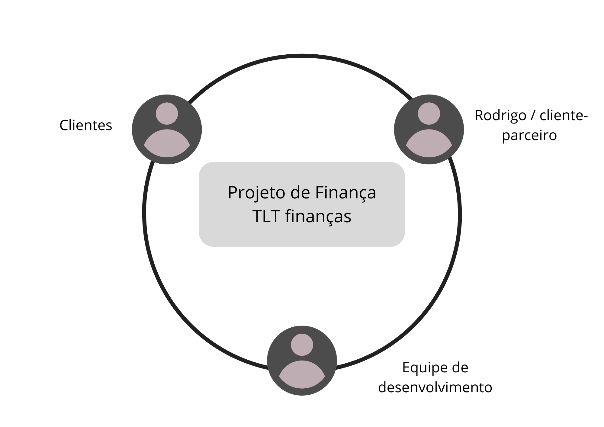

# 1 CENÁRIO ATUAL DO CLIENTE E DO NEGÓCIO

## 1.1 Identificação do Cliente/Parceiro

- **Nome**: Rodrigo Atila
- **Tipo**: Aluno da UnB
- **Representante**: Rodrigo Atila
- **Forma de contato**: Reuniões semanais por meio de encontros presenciais, videoconferências e mensagens instantâneas
- **Vínculo com o projeto**: Cliente real e contato principal como tomador de decisão, responsável por alinhar e informar as necessidades do público-alvo, autorizar definições do projeto e avaliar a qualidade dos incrementos entregues.

---

## 1.2 Introdução ao Negócio e Contexto

O contexto deste projeto está inserido na realidade de indivíduos e famílias de baixa renda que convivem com limitações persistentes de orçamento, alta exposição ao endividamento e baixa capacidade de formação de reserva financeira. De acordo com a diretoria de Economia e Inovação (Dein) da CNC, em 2022, 78,9% das famílias até 10 salários mínimos já estavam endividadas, enquanto a inadimplência entre as famílias mais pobres chegou a 32,3%. conforme a matéria da Agência Brasil sobre a Pesquisa de Endividamento e Inadimplência do Consumidor (Peic), janeiro de 2026, a inadimplência alcançou 38,9% nos lares com até 3 salários mínimos, evidenciando que a pressão financeira é mais intensa justamente entre os grupos de menor renda.

Outro aspecto relevante é a concentração das dívidas em modalidades de maior custo e menor flexibilidade. O estudo, feito pela Peic também destaca que cerca de 85% das dívidas das famílias endividadas estão ligadas ao cartão de crédito, enquanto o crédito rotativo segue como uma das formas mais críticas de financiamento, com inadimplência próxima de 60,5% em 2025 de acordo com dados do Banco Central. Esse padrão sugere que parte relevante da população recorre ao crédito como complemento da renda, o que tende a aprofundar o desequilíbrio financeiro quando surgem imprevistos ou aumento no custo de vida.

Além disso, esse cenário é agravado pela ausencia de educação financeira, como pode ser visto pelo estudo do efeito da educação financeira e atitudes frente ao dinheiro na propensão ao endividamento, feito pela Revista Mineira de Contabilidade o qual evidencia que indivíduos com menor nível de conhecimento financeiro tendem a apresentar maior dificuldade no controle de gastos, no planejamento orçamentário e na compreensão de conceitos como juros e crédito. Essa limitação contribui diretamente para decisões financeiras menos eficientes, como o uso recorrente de crédito de alto custo e a ausência de estratégias de poupança, reforçando ciclos de endividamento e desorganização financeira ao longo do tempo.

---

## 1.3 Rich Picture

---

## 1.4 Identificação da Oportunidade ou Problema

O principal problema identificado pela equipe Tengo Lengo Tengo no âmbito social é a falta de controle das finanças em uma larga parcela da sociedade brasileira, de acordo com dados da Pesquisa de Endividamento e Inadimplência do Consumidor (Peic), da Confederação Nacional do Comércio de Bens, Serviços e Turismo (CNC) revelam que, em março de 2026, 80,4% das famílias estavam endividadas; e 29,4% tinham contas em atraso. Esses números refletem a falta de controle e organização financeira que afeta grande parte da população brasileira. Com a crescente digitalização da sociedade, muitas pessoas ainda enfrentam dificuldades para manter o controle financeiro no dia a dia, o que resulta em atrasos de pagamentos, desorganização do fluxo de caixa e ausência de planejamento mensal. Esse cenário é agravado por condições econômicas que reduzem a capacidade de organização do orçamento, além da dificuldade em acompanhar entradas e saídas em tempo real e em rastrear pagamentos e recebimentos com precisão.

Adicionalmente, a falta de materiais de apoio, o uso de planilhas manuais pouco práticas, o baixo nível de conhecimento em gestão financeira e a dificuldade em manter a disciplina nos lançamentos contribuem para um fluxo financeiro desorganizado. Soma-se a isso o fato de que muitas soluções disponíveis são pagas e inacessíveis para parte dos usuários, além de apresentarem integração limitada com bancos e meios de pagamento digitais. Esse conjunto de fatores evidencia a necessidade de uma ferramenta simples, acessível e eficiente que auxilie no controle das finanças pessoais.

Diante das dificuldades enfrentadas por pessoas físicas no controle das finanças, identifica-se a oportunidade de desenvolver uma plataforma digital acessível, intuitiva e integrada. Essa solução deve permitir o registro simplificado de entradas e saídas, rastreamento claro de pagamentos e recebimentos, além de oferecer visualização em tempo real do fluxo de caixa.

Adicionalmente, ao incorporar recursos de apoio à educação financeira e integração com serviços bancários e pagamentos digitais, a ferramenta pode reduzir a dependência de controles manuais e aumentar a precisão das informações. Com isso, torna-se possível apoiar o usuário na tomada de decisões mais conscientes, reduzir atrasos e promover maior organização financeira no cotidiano, atendendo diretamente às necessidades evidenciadas no cenário apresentado.

---

## 1.5 Desafios do Projeto

O principal desafio do projeto é a falta de conhecimento financeiro dos usuários, fator que os leva ao endividamento e à falta de visibilidade sobre os próprios gastos realizados em um período determinado de tempo. Essa carência de conhecimento não apenas impossibilita o planejamento a curto prazo, como também empurra os indivíduos para o endividamento crônico, uma vez que a falta de hábitos de monitoramento impede a identificação precoce do problema.

Outro desafio é garantir a usabilidade intuitiva do produto, visto que qualquer barreira encontrada na interface pode prejudicar o público já fragilizado pelo caos financeiro. A dificuldade do uso torna-se um obstáculo crítico, pois usuários com baixa familiaridade tecnológica tendem a abandonar ferramentas que não ofereçam respostas imediatas.

---

## 1.6 Mapa de Stakeholders

Os principais stakeholders do projeto são: Rodrigo Atila, como representante do cliente e um dos principais responsáveis por validar prioridades e entregas; usuários do produto, que esperam um auxílio financeiro e uma experiência simples e intuitiva; e a equipe de desenvolvimento, responsável por implementar a solução e viabilizar tecnicamente a integração, a usabilidade, a segurança e a escalabilidade da plataforma.

A seguir, é apresentado um quadro resumo dos stakeholders.

| Stakeholder | Relação com a solução | Interesse principal | Influência |
|-------------|----------------------|---------------------|-----------|
| Rodrigo Atila | Cliente/Representante | Validar escopo, prioridades e entregas | Alta |
| Clientes do TLT finanças | Usuários finais | Receber auxílio na parte da autonomia financeira | Médio |
| Equipe de desenvolvimento | Responsável pela construção do produto | Entregar uma solução viável e de qualidade | Alta |

---

## 1.7 Segmentação de Clientes

- **Jovens adultos em início de vida financeira (18-29 anos)**: Este grupo inclui estudantes universitários e profissionais em início de carreira que estão começando a lidar com renda própria. Possuem pouca experiência em organização financeira e frequentemente enfrentam dificuldades para controlar gastos e evitar dívidas.

- **Adultos economicamente ativos (30-50 anos)**: São usuários com renda estável que precisam gerenciar múltiplas despesas, como moradia, alimentação, transporte e, em alguns casos, família. Valorizam ferramentas que oferecem controle detalhado do fluxo de caixa, planejamento financeiro e previsibilidade de gastos.

- **Usuários com baixo nível de educação financeira**: Independente da faixa etária, este grupo é composto por indivíduos que possuem dificuldades em compreender conceitos financeiros básicos, são mais propensos ao endividamento e à desorganização financeira.

---