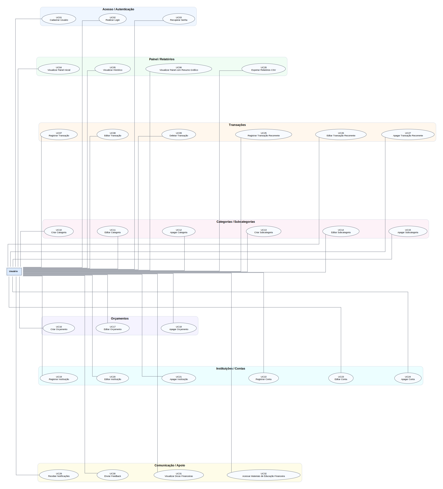

# Casos de Uso - TLT Finanças

**Documento Consolidado de Especificação de Software**

## Atores do Sistema

- **Usuário**: Indivíduo que utiliza o sistema para gerenciar suas finanças pessoais.

---

## UC01 - Cadastrar Usuário

**Descrição:** Permite ao usuário criar uma conta no sistema.  
**Pré-condições:** Usuário não deve estar cadastrado.  
**Pós-condições:** Conta criada com sucesso.

**Fluxo Principal:**

1. Acessa tela de cadastro.
2. Informa dados como nome, email e senha.
3. Confirma o cadastro.
4. Sistema valida os dados informados.
5. Sistema cria a conta.
6. Usuário é redirecionado para o login.

**Fluxos Alternativos:**

- Não existe

**Fluxos de Exceção:**

- Usuário ou email já cadastrado: sistema exibe erro.
- Dados inválidos: sistema solicita correção.

---

## UC02 - Realizar Login

**Descrição:** Permite o acesso do usuário à sua conta no sistema.  
**Pré-condições:** Usuário deve estar cadastrado.  
**Pós-condições:** Usuário autenticado no sistema.

**Fluxo Principal:**

1. Acessa a tela de login.
2. Informa as credenciais (email e senha).
3. Sistema valida as credenciais.
4. Acesso ao sistema é concedido.

**Fluxos Alternativos:**

- Não existe

**Fluxos de Exceção:**

- Credenciais inválidas: erro exibido.
- Falha de conexão: sistema exibe mensagem de erro.

---

## UC03 - Recuperar Senha

**Descrição:** Permite ao usuário redefinir sua senha caso a tenha esquecido.  
**Pré-condições:** Usuário possui conta cadastrada e tem acesso ao e-mail vinculado.  
**Pós-condições:** Senha é atualizada e o usuário pode realizar login com a nova credencial.

**Fluxo Principal:**

1. Na tela de login, clica em "Esqueci minha senha".
2. Informa o e-mail cadastrado e o sistema valida.
3. Sistema envia link de recuperação.
4. Usuário acessa o link, informa e confirma nova senha.
5. Sistema valida os dados, atualiza a senha e redireciona para o login.

**Fluxos Alternativos:**

- **Recuperação via SMS:** Se o usuário tiver um telefone vinculado à conta, ele pode optar por receber um código (OTP) por SMS para redefinir a senha dentro do próprio aplicativo, em vez de acessar um link externo por e-mail.

**Fluxos de Exceção:**

- Email não cadastrado ou senha inválida: sistema exige correção.
- Falha no envio do e-mail ou link inválido/expirado: sistema informa erro ou solicita nova requisição.

**Regras de Negócio:**

- O link expira após um período definido e é de uso único.
- Senha deve atender critérios de segurança e senhas anteriores não podem ser reutilizadas.

---

## UC04 - Visualizar Painel Inicial (sem gráficos)

**Descrição:** Exibe ao usuário uma visão geral simplificada de suas finanças, sem componentes gráficos.  
**Pré-condições:** Usuário autenticado.  
**Pós-condições:** Painel inicial exibido com saldo, últimas transações e resumo básico.

**Fluxo Principal:**

1. Usuário acessa o painel inicial após login.
2. Sistema carrega e exibe saldo total, resumo de receitas e despesas do mês atual.
3. Sistema lista as últimas transações registradas.
4. Usuário visualiza o saldo total e o orçamento mais próximo do limite.

**Fluxos Alternativos:**

- **Modo Privacidade:** O usuário toca no ícone de "olho" para ocultar os valores numéricos de saldos e transações visíveis na tela, protegendo as informações de terceiros ao seu redor.

**Fluxos de Exceção:**

- Nenhum dado registrado: sistema exibe painel vazio com mensagem orientativa.
- Falha ao carregar dados: sistema exibe mensagem de erro e botão para tentar novamente.

---

## UC05 - Visualizar Histórico pelo Painel Inicial

**Descrição:** Permite ao usuário acessar e visualizar o histórico completo de transações diretamente do painel inicial.  
**Pré-condições:** Usuário autenticado e existência de transações registradas.  
**Pós-condições:** Histórico de transações exibido com opções de filtro e ordenação.

**Fluxo Principal:**

1. No painel inicial, usuário clica em "Ver histórico completo" ou desliza a lista de transações recentes.
2. Sistema exibe tela de histórico com lista completa de transações em ordem cronológica inversa.
3. Usuário pode aplicar filtros por período, tipo ou categoria.
4. Sistema atualiza a lista conforme filtros aplicados.

**Fluxos Alternativos:**

- **Busca por texto:** O usuário utiliza a barra de pesquisa para digitar o nome de um estabelecimento ou descrição específica, filtrando a lista independentemente das opções de categoria ou período.

**Fluxos de Exceção:**

- Nenhuma transação encontrada para os filtros: sistema exibe mensagem "Nenhum resultado".
- Falha ao carregar histórico: sistema exibe erro e botão para recarregar.

---

## UC06 - Visualizar Painel com Resumo Gráfico

**Descrição:** Exibe painel financeiro consolidado com um resumo gráfico interativo.  
**Pré-condições:** Usuário autenticado.  
**Pós-condições:** Painel com gráficos exibido, apresentando saldo, receitas, despesas e distribuição por categorias.

**Fluxo Principal:**

1. Acessa o dashboard ou área de relatórios visuais.
2. Define filtros de período, se necessário.
3. Sistema gera e exibe gráficos: saldo total, receitas vs despesas, gastos por categoria.
4. Usuário interage com os gráficos (tooltips, zoom, cliques).

**Fluxos Alternativos:**

- Não existe

**Fluxos de Exceção:**

- Nenhum dado disponível: sistema exibe painel vazio com mensagem orientativa.
- Período sem movimentações: sistema informa ausência de dados para o período.

---

## UC07 - Registrar Transação (Receita ou Despesa)

**Descrição:** Permite registrar entradas (receitas) ou saídas (despesas) de dinheiro.  
**Pré-condições:** Usuário autenticado.  
**Pós-condições:** Transação registrada e saldo atualizado.

**Fluxo Principal:**

1. Acessa a função "Nova transação".
2. Informa os dados: valor, tipo (receita/despesa), categoria e data.
3. Confirma o registro e o sistema salva.
4. Saldo é atualizado.

**Fluxos Alternativos:**

- Não existe

**Fluxos de Exceção:**

- Dados incompletos, campos vazios ou valores inválidos: sistema exibe erro.
- Sem conexão com internet: transação é salva offline e sincronizada posteriormente.

---

## UC08 - Editar Transação

**Descrição:** Permite ao usuário modificar os dados de uma transação financeira registrada anteriormente.  
**Pré-condições:** Usuário autenticado e existência de pelo menos uma transação.  
**Pós-condições:** Transação atualizada e saldo recalculado.

**Fluxo Principal:**

1. Acessa a lista de transações e seleciona a transação desejada.
2. Clica em "Editar" e o sistema exibe os dados atuais em um formulário editável.
3. Usuário altera os campos desejados (valor, tipo, categoria, data).
4. Confirma a edição e o sistema valida os novos dados.
5. Sistema salva as alterações e atualiza o saldo.

**Fluxos Alternativos:**

- Não existe

**Fluxos de Exceção:**

- Dados inválidos ou campos vazios: sistema exibe erro e solicita correção.
- Transação não encontrada: sistema exibe mensagem informativa.
- Usuário cancela a edição: alterações são descartadas.

---

## UC09 - Deletar Transação

**Descrição:** Permite ao usuário excluir uma transação financeira registrada.  
**Pré-condições:** Usuário autenticado e existência de pelo menos uma transação.  
**Pós-condições:** Transação removida e saldo atualizado corretamente.

**Fluxo Principal:**

1. Acessa a lista de transações, seleciona uma e clica em "Excluir".
2. Sistema solicita confirmação da ação e o usuário confirma.
3. Sistema remove a transação, atualiza o saldo e exibe mensagem de sucesso.

**Fluxos Alternativos:**

- **Exclusão em Lote:** O usuário ativa o modo de seleção, marca várias transações simultaneamente e clica em "Excluir" para remover todas de uma só vez com apenas uma confirmação.

**Fluxos de Exceção:**

- Transação não encontrada ou erro ao excluir: sistema exibe falha.
- Usuário cancela a operação: exclusão interrompida.

---

## UC10 - Criar Categoria de Transação

**Descrição:** Permite ao usuário criar uma nova categoria personalizada para classificar suas transações.  
**Pré-condições:** Usuário autenticado.  
**Pós-condições:** Categoria criada e disponível para uso em transações.

**Fluxo Principal:**

1. Acessa as configurações de categorias e seleciona "Nova categoria".
2. Informa o nome da categoria e, opcionalmente, escolhe um ícone ou cor.
3. Confirma a criação e o sistema valida.
4. Sistema salva a nova categoria e a disponibiliza na lista.

**Fluxos Alternativos:**

- - **Criar categoria inline:** Durante o preenchimento, o usuário nota que a categoria desejada não existe e seleciona "Nova Categoria", criando-a diretamente no fluxo do formulário sem perder os dados já inseridos.

**Fluxos de Exceção:**

- Nome de categoria já existente: sistema exibe erro e sugere outro nome.
- Nome vazio ou inválido: sistema solicita preenchimento correto.

---

## UC11 - Editar Categoria de Transação

**Descrição:** Permite ao usuário modificar o nome ou aparência de uma categoria existente.  
**Pré-condições:** Usuário autenticado e existência de pelo menos uma categoria.  
**Pós-condições:** Categoria atualizada e alterações refletidas nas transações associadas.

**Fluxo Principal:**

1. Acessa a lista de categorias e seleciona a categoria desejada.
2. Clica em "Editar" e altera o nome, ícone ou cor.
3. Confirma a edição e o sistema valida.
4. Sistema salva as alterações.

**Fluxos Alternativos:**

- Não existe

**Fluxos de Exceção:**

- Novo nome já utilizado por outra categoria: sistema exibe erro.
- Categoria padrão do sistema: edição limitada (apenas cor/ícone).
- Usuário cancela: alterações descartadas.

---

## UC12 - Apagar Categoria de Transação

**Descrição:** Permite ao usuário remover uma categoria personalizada do sistema.  
**Pré-condições:** Usuário autenticado e categoria a ser excluída não pode ser padrão do sistema.  
**Pós-condições:** Categoria removida; transações associadas são movidas para categoria padrão ou solicitam reclassificação.

**Fluxo Principal:**

1. Acessa a lista de categorias e seleciona a categoria.
2. Clica em "Excluir" e o sistema verifica se há transações vinculadas.
3. Sistema alerta sobre transações que serão desvinculadas e solicita confirmação.
4. Usuário confirma e o sistema remove a categoria.

**Fluxos Alternativos:**

- **Exclusão em cascata:** O sistema oferece a opção "Apagar categoria e todas as transações vinculadas", permitindo que o usuário limpe de uma só vez a classificação e o histórico atrelado a ela.

**Fluxos de Exceção:**

- Categoria com transações vinculadas: sistema oferece opção de reclassificar para outra categoria.
- Tentativa de excluir categoria padrão: sistema bloqueia a ação.
- Usuário cancela: categoria mantida.

---

## UC13 - Criar Subcategoria de Transação

**Descrição:** Permite ao usuário criar uma subcategoria vinculada a uma categoria existente para detalhar melhor suas transações.  
**Pré-condições:** Usuário autenticado e existência de categoria pai.  
**Pós-condições:** Subcategoria criada e disponível para classificação de transações.

**Fluxo Principal:**

1. Acessa configurações de categorias e seleciona uma categoria pai.
2. Clica em "Nova subcategoria" e informa o nome.
3. Confirma e sistema valida unicidade dentro da categoria pai.
4. Sistema salva a subcategoria.

**Fluxos Alternativos:**

- **Conversão de Categoria Principal:** O usuário seleciona uma Categoria principal existente no painel geral e escolhe "Converter em subcategoria", selecionando em seguida qual será o novo "Pai" daquele agrupamento.

**Fluxos de Exceção:**

- Subcategoria já existente na mesma categoria pai: sistema exibe erro.
- Nome vazio: sistema solicita preenchimento.

---

## UC14 - Editar Subcategoria de Transação

**Descrição:** Permite modificar o nome de uma subcategoria existente.  
**Pré-condições:** Usuário autenticado e subcategoria existente.  
**Pós-condições:** Subcategoria renomeada e transações associadas atualizadas.

**Fluxo Principal:**

1. Acessa a lista de subcategorias dentro da categoria pai.
2. Seleciona a subcategoria e clica em "Editar".
3. Altera o nome e confirma.
4. Sistema valida e salva.

**Fluxos Alternativos:**

- **Mudar Categoria Pai:** Durante a edição, o usuário opta por transferir a subcategoria para uma nova Categoria Pai em vez de apenas renomeá-la.

**Fluxos de Exceção:**

- Novo nome já existe na mesma categoria pai: sistema rejeita.
- Usuário cancela: nome mantido.

---

## UC15 - Apagar Subcategoria de Transação

**Descrição:** Permite remover uma subcategoria do sistema.  
**Pré-condições:** Usuário autenticado e subcategoria existente.  
**Pós-condições:** Subcategoria removida; transações associadas reclassificadas para a categoria pai ou outra escolhida.

**Fluxo Principal:**

1. Acessa a lista de subcategorias e seleciona a subcategoria.
2. Clica em "Excluir" e sistema verifica transações vinculadas.
3. Sistema oferece opção de mover transações para categoria pai ou outra subcategoria.
4. Usuário escolhe e confirma; sistema remove a subcategoria.

**Fluxos Alternativos:**

- Não existe

**Fluxos de Exceção:**

- Usuário cancela: subcategoria mantida.
- Erro ao reclassificar: sistema notifica e aborta.

---

## UC16 - Criar Orçamento

**Descrição:** Permite criar objetivos financeiros e definir metas/limites de gastos mensais.  
**Pré-condições:** Usuário autenticado.  
**Pós-condições:** Planejamento e meta registrados no sistema.

**Fluxo Principal:**

1. Acessa a área de metas ou planejamento.
2. Define o valor/prazo da meta e os limites de gastos por categoria.
3. Sistema salva o registro e inicia o acompanhamento do progresso.

**Fluxos Alternativos:**

- Não existe

**Fluxos de Exceção:**

- Dados ou valores informados são inválidos: sistema exibe erro.

---

## UC17 - Editar Orçamento

**Descrição:** Permite ao usuário modificar metas financeiras e limites de gastos existentes.  
**Pré-condições:** Usuário autenticado e existência de pelo menos uma meta ou orçamento cadastrado.  
**Pós-condições:** Meta ou orçamento atualizado e progresso recalculado.

**Fluxo Principal:**

1. Acessa a área de metas e seleciona o planejamento desejado.
2. Clica em "Editar" e modifica valores, prazos ou limites de categoria.
3. Confirma e o sistema valida os novos dados.
4. Sistema salva e atualiza o acompanhamento.

**Fluxos Alternativos:**

- **Edição Restrita ao Mês Vigente:** O usuário decide aplicar a alteração dos limites apenas para o mês atual (devido a um gasto atípico), mantendo a regra antiga para os meses futuros.

**Fluxos de Exceção:**

- Dados inválidos: sistema exibe erro e mantém os valores anteriores.
- Usuário cancela: alterações descartadas.

---

## UC18 - Apagar Orçamento

**Descrição:** Permite ao usuário remover um planejamento financeiro ou meta do sistema.  
**Pré-condições:** Usuário autenticado e existência de meta ou orçamento.  
**Pós-condições:** Planejamento removido e dados de progresso excluídos.

**Fluxo Principal:**

1. Acessa a lista de metas/orçamentos e seleciona o item.
2. Clica em "Excluir" e o sistema solicita confirmação.
3. Usuário confirma e o sistema remove o registro.

**Fluxos Alternativos:**

- Não existe

**Fluxos de Exceção:**

- Usuário cancela: item mantido.
- Erro ao excluir: sistema exibe mensagem de falha.

---

## UC19 - Registrar Instituição Financeira

**Descrição:** Permite ao usuário cadastrar uma instituição financeira (banco, corretora, etc.) no sistema.  
**Pré-condições:** Usuário autenticado.  
**Pós-condições:** Instituição registrada e disponível para associação a contas.

**Fluxo Principal:**

1. Acessa "Instituições" no menu e clica em "Nova instituição".
2. Informa nome da instituição, tipo (banco, corretora, fintech) e, opcionalmente, logotipo.
3. Confirma e o sistema valida.
4. Sistema salva a instituição.

**Fluxos Alternativos:**

- Não existe

**Fluxos de Exceção:**

- Instituição já cadastrada: sistema exibe erro.
- Dados incompletos: sistema solicita preenchimento.

---

## UC20 - Editar Registro de Instituição

**Descrição:** Permite modificar os dados de uma instituição financeira previamente cadastrada.  
**Pré-condições:** Usuário autenticado e instituição existente.  
**Pós-condições:** Dados da instituição atualizados.

**Fluxo Principal:**

1. Acessa a lista de instituições e seleciona a desejada.
2. Clica em "Editar" e modifica os campos permitidos.
3. Confirma e o sistema salva as alterações.

**Fluxos Alternativos:**

- Não existe

**Fluxos de Exceção:**

- Nome duplicado com outra instituição: sistema rejeita.
- Usuário cancela: dados originais mantidos.

---

## UC21 - Apagar Registro de Instituição

**Descrição:** Permite remover uma instituição financeira do sistema.  
**Pré-condições:** Usuário autenticado e instituição sem contas vinculadas ativas.  
**Pós-condições:** Instituição removida do cadastro.

**Fluxo Principal:**

1. Acessa a lista de instituições e seleciona a instituição.
2. Clica em "Excluir" e o sistema verifica vínculos com contas.
3. Sistema solicita confirmação e usuário confirma.
4. Sistema remove a instituição.

**Fluxos Alternativos:**

- Não existe

**Fluxos de Exceção:**

- Instituição com contas vinculadas: sistema bloqueia exclusão e orienta remover contas primeiro.
- Usuário cancela: instituição mantida.

---

## UC22 - Registrar Conta em Instituição

**Descrição:** Permite ao usuário registrar uma conta financeira (corrente, poupança, investimento) vinculada a uma instituição.  
**Pré-condições:** Usuário autenticado e instituição previamente cadastrada.  
**Pós-condições:** Conta registrada e saldo inicial configurado.

**Fluxo Principal:**

1. Acessa "Contas" e seleciona "Nova conta".
2. Escolhe a instituição e informa dados: tipo de conta, saldo inicial, descrição.
3. Confirma e o sistema valida.
4. Sistema salva a conta e a disponibiliza no painel.

**Fluxos Alternativos:**

- Não existe

**Fluxos de Exceção:**

- Saldo inicial inválido: sistema exibe erro.
- Instituição não encontrada: sistema orienta cadastrar instituição primeiro.

---

## UC23 - Editar Conta de Instituição

**Descrição:** Permite modificar os dados de uma conta financeira registrada.  
**Pré-condições:** Usuário autenticado e conta existente.  
**Pós-condições:** Dados da conta atualizados.

**Fluxo Principal:**

1. Acessa a lista de contas e seleciona a conta.
2. Clica em "Editar" e modifica dados como saldo, descrição ou tipo.
3. Confirma e o sistema salva as alterações.

**Fluxos Alternativos:**

- **Reajuste Automático de Saldo:** O usuário não digita o saldo manualmente, optando por inserir o valor atual real de sua conta bancária, e o sistema cria uma transação de "Ajuste de Saldo" para igualar os valores de forma rastreável.

**Fluxos de Exceção:**

- Saldo editado não pode gerar inconsistências: sistema alerta sobre impacto no histórico.
- Usuário cancela: dados mantidos.

---

## UC24 - Apagar Conta de Instituição

**Descrição:** Permite apagar o registro de uma conta financeira cadastrada.  
**Pré-condições:** Usuário autenticado e conta existente.  
**Pós-condições:** Conta apagada.

**Fluxo Principal:**

1. Acessa a lista de contas e seleciona a conta.
2. Clica em "Apagar".
3. Sistema solicita confirmação e usuário confirma.
4. Sistema remove a conta.

**Fluxos Alternativos:**

- Não existe

**Fluxos de Exceção:**

- Usuário cancela: item mantido.
- Erro ao excluir: sistema exibe mensagem de falha.

---

## UC25 - Registrar Transação Recorrente

**Descrição:** Permite ao usuário cadastrar uma transação que se repete periodicamente (assinaturas, salário, etc.).  
**Pré-condições:** Usuário autenticado.  
**Pós-condições:** Recorrência registrada e transações futuras serão geradas automaticamente.

**Fluxo Principal:**

1. Acessa "Recorrências" e clica em "Nova recorrência".
2. Informa dados da transação base: valor, tipo, categoria, frequência (diária, semanal, mensal, anual) e data de início.
3. Opcionalmente define data de término.
4. Confirma e o sistema valida e salva.

**Fluxos Alternativos:**

- **Recorrência em Dias Úteis:** O usuário assinala a opção de que, caso a data de vencimento caia no fim de semana, o sistema deve registrar e projetar a transação para o próximo dia útil subsequente.

**Fluxos de Exceção:**

- Frequência inválida ou data de término anterior ao início: sistema exibe erro.
- Valor zerado: sistema rejeita.

---

## UC26 - Editar Transação Recorrente

**Descrição:** Permite modificar uma recorrência existente.  
**Pré-condições:** Usuário autenticado e recorrência cadastrada.  
**Pós-condições:** Recorrência atualizada; alterações podem afetar transações futuras ou todas as instâncias.

**Fluxo Principal:**

1. Acessa lista de recorrências e seleciona a desejada.
2. Clica em "Editar" e modifica os campos valor, tipo, categoria, frequência (diária, semanal, mensal, anual) e data de início.
3. Sistema pergunta se a alteração se aplica a todas as instâncias ou apenas às futuras.
4. Usuário escolhe e confirma; sistema salva.

**Fluxos Alternativos:**

- **Pular Ocorrência:** O usuário opta apenas por pular ou ignorar a ocorrência do mês atual, mantendo as configurações gerais e a programação ativa para o mês subsequente.

**Fluxos de Exceção:**

- Alteração retroativa pode causar inconsistências: sistema alerta.
- Usuário cancela: recorrência mantida.

---

## UC27 - Apagar Transação Recorrente

**Descrição:** Permite cancelar uma recorrência, interrompendo a geração de transações futuras.  
**Pré-condições:** Usuário autenticado e recorrência existente.  
**Pós-condições:** Recorrência removida; transações futuras não serão mais geradas.

**Fluxo Principal:**

1. Acessa lista de recorrências e seleciona a recorrência.
2. Clica em "Excluir" e sistema pergunta como lidar com transações já geradas, se mantem ou remove todas.
3. Usuário escolhe manter ou remover instâncias futuras e confirma.
4. Sistema processa a exclusão.

**Fluxos Alternativos:**

- **Pausar Recorrência:** O usuário decide pausar a assinatura indefinidamente, interrompendo as previsões futuras sem remover a configuração matriz para fácil reativação no futuro.

**Fluxos de Exceção:**

- Usuário cancela: recorrência mantida.
- Erro ao remover instâncias: sistema notifica falha parcial.

---

## UC28 - Exportar Relatórios CSV

**Descrição:** Permite exportar relatórios financeiros em formato CSV.  
**Pré-condições:** Usuário autenticado e existência de dados registrados.  
**Pós-condições:** Relatório gerado, exibido e disponibilizado para download.

**Fluxo Principal:**

1. Acessa a área de relatórios.
2. Escolhe o formato de exportação e confirma.
3. Sistema gera os gráficos/relatório e disponibiliza para download.
4. Usuário realiza o download do arquivo.

**Fluxos Alternativos:**

- **Compartilhamento Direto:** Após a geração do CSV, em vez do download para a pasta local, o sistema abre o modal nativo do dispositivo móvel para compartilhamento (ex: WhatsApp, Email ou Google Drive).

**Fluxos de Exceção:**

- Período inválido ou sem dados suficientes: sistema solicita correção ou emite aviso.
- Formato não suportado ou erro ao gerar/baixar: sistema informa falha.

---

## UC29 - Receber Notificações de Alerta

**Descrição:** Notificação de limites de gastos atingidos ou próximos de 80%.  
**Pré-condições:** Limite de gastos deve estar previamente definido.  
**Pós-condições:** Alertas enviados ao usuário por meio de notificações push ou dentro do sistema.

**Fluxo Principal:**

1. Sistema monitora os gastos do usuário em relação aos limites definidos.
2. Quando um limite é atingido ou está próximo de 80%, o sistema gera um alerta.
3. Usuário recebe a notificação no dispositivo ou na central de notificações do app.
4. Usuário pode tocar na notificação para ver detalhes.

**Fluxos Alternativos:**

- **Central in-app:** O usuário com permissões de Push desativadas (ou no modo Não Perturbe) acessa o histórico de limites estourados através de uma "Central de Avisos" representada pelo ícone de sino dentro do próprio aplicativo.

**Fluxos de Exceção:**

- Limite não configurado: sistema não envia notificação de limite.
- Permissão de notificação negada: sistema exibe alerta apenas internamente.

---

## UC30 - Enviar Feedback

**Descrição:** Permite enviar feedback, reportar erros ou sugerir melhorias para o app TLT Finanças.  
**Pré-condições:** Usuário autenticado.  
**Pós-condições:** Feedback registrado e confirmação de envio exibida ao usuário.

**Fluxo Principal:**

1. Acessa "Enviar feedback", seleciona o tipo (erro, sugestão, elogio) e descreve o problema/sugestão.
2. Opcionalmente, anexa arquivos/imagens e confirma.
3. Sistema valida, registra o feedback e exibe a confirmação de envio.

**Fluxos Alternativos:**

- **Envio de Log de Diagnóstico Automático:** Após uma falha fatal (crash), ao reiniciar o app o sistema detecta o ocorrido e sugere o envio de um relatório gerado automaticamente contendo os rastros da falha (stack trace), exigindo apenas o consentimento do usuário.

**Fluxos de Exceção:**

- Descrição vazia ou arquivo grande/inválido: sistema exibe erro.
- Falha no envio: sistema sugere tentar novamente mais tarde.

---

## UC31 - Visualizar Dicas Financeiras

**Descrição:** Usuário acessa dicas financeiras personalizadas com base no comportamento do usuário.  
**Pré-condições:** Usuário autenticado.  
**Pós-condições:** Dicas exibidas ao usuário em área específica.

**Fluxo Principal:**

1. Sistema analisa o comportamento financeiro do usuário.
2. Com base nos padrões identificados, gera dicas personalizadas.
3. Usuário acessa a seção "Dicas" no menu.
4. Sistema exibe as dicas geradas.

**Fluxos Alternativos:**

- **Refinamento do Algoritmo:** O usuário interage com uma dica fornecendo feedback rápido (ex: marcando com botões "Útil" ou "Irrelevante"), treinando o algoritmo e solicitando a substituição imediata da dica por uma nova.

**Fluxos de Exceção:**

- Dados insuficientes de uso: sistema exibe dicas genéricas de educação financeira.
- Falha ao gerar dicas: sistema convida usuário a retornar mais tarde.

---

## UC32 - Acessar Materiais de Educação Financeira

**Descrição:** Permite acessar uma aba com conteúdos educativos recomendados.  
**Pré-condições:** Autenticação no sistema e conexão ativa com a internet.  
**Pós-condições:** Materiais visualizados e acesso registrado.

**Fluxo Principal:**

1. No menu principal, seleciona "Materiais de Educação Financeira".
2. Sistema carrega os conteúdos, divididos por categorias.
3. Usuário seleciona um material e consome o conteúdo exibido.

**Fluxos Alternativos:**

- **Download para acesso offline:** O usuário clica no ícone de nuvem para baixar um material em PDF, salvando-o no armazenamento local do dispositivo para leitura sem conexão no futuro.

**Fluxos de Exceção:**

- Falha de conexão ou conteúdo indisponível/link inválido: sistema exibe erro ou retorna à lista.
