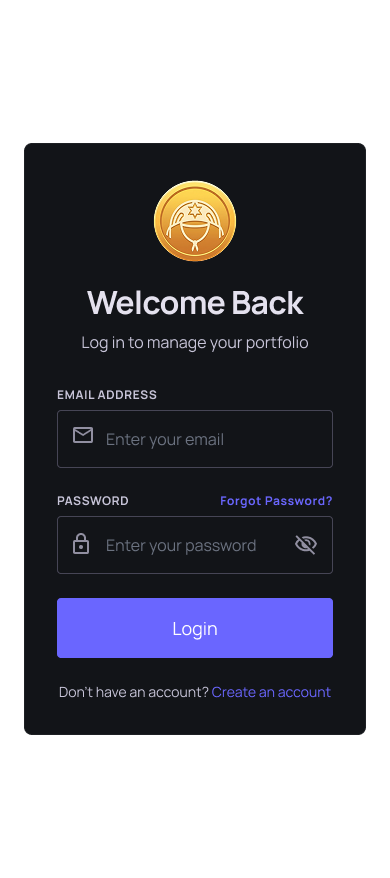
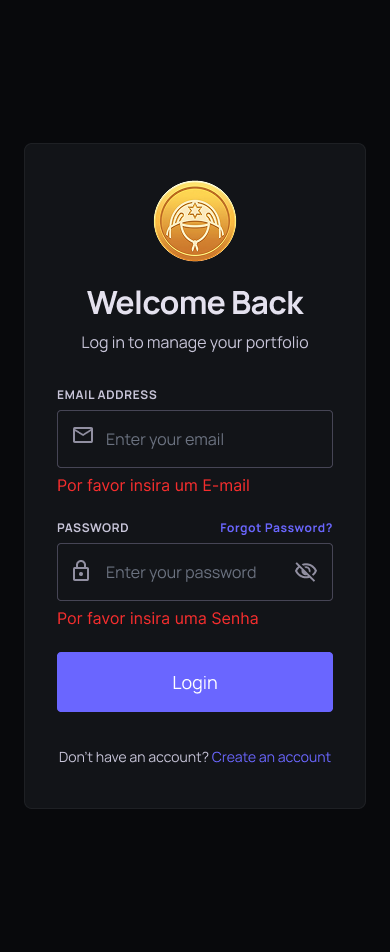

## UC02 - Realizar Login

**Autor:** Usuário.
**Descrição:** Permite o acesso do usuário à sua conta no sistema.  
**Pré-condições:** Usuário deve estar cadastrado.  
**Pós-condições:** Usuário autenticado no sistema.

**Fluxo Principal:**

1. Acessa a tela de login.
2. Informa as credenciais (email e senha).
3. Sistema valida as credenciais.
4. Acesso ao sistema é concedido.

**Fluxos Alternativos:**

- Não existe

**Fluxos de Exceção:**

- Credenciais inválidas: erro exibido.
- Falha de conexão: sistema exibe mensagem de erro.

**Imagem do Protótipo**

{: width="250" }
{: width="250" }
{: .img-row }

[Clique aqui para ver o protótipo completo.](../../entregas/prototipo.md)

---

