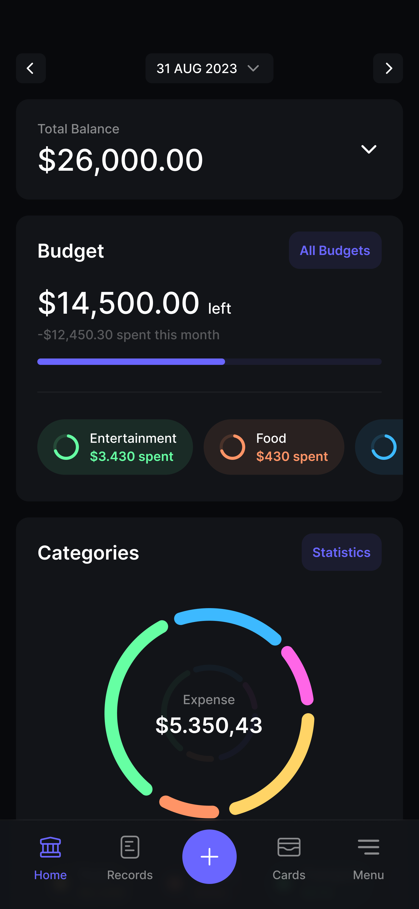

## UC04 - Visualizar Painel Inicial (sem gráficos)

**Autor:** Usuário.
**Descrição:** Exibe ao usuário uma visão geral simplificada de suas finanças, sem componentes gráficos.  
**Pré-condições:** Usuário autenticado.  
**Pós-condições:** Painel inicial exibido com saldo, últimas transações e resumo básico.

**Fluxo Principal:**

1. Usuário acessa o painel inicial após login.
2. Sistema carrega e exibe saldo total, resumo de receitas e despesas do mês atual.
3. Sistema lista as últimas transações registradas.
4. Usuário visualiza o saldo total e o orçamento mais próximo do limite.

**Fluxos Alternativos:**

- **Modo Privacidade:** O usuário toca no ícone de "olho" para ocultar os valores numéricos de saldos e transações visíveis na tela, protegendo as informações de terceiros ao seu redor.

**Fluxos de Exceção:**

- Nenhum dado registrado: sistema exibe painel vazio com mensagem orientativa.
- Falha ao carregar dados: sistema exibe mensagem de erro e botão para tentar novamente.

**Imagem do Protótipo**

{: width="250" .center }

[Clique aqui para ver o protótipo completo.](../../entregas/prototipo.md)

---

