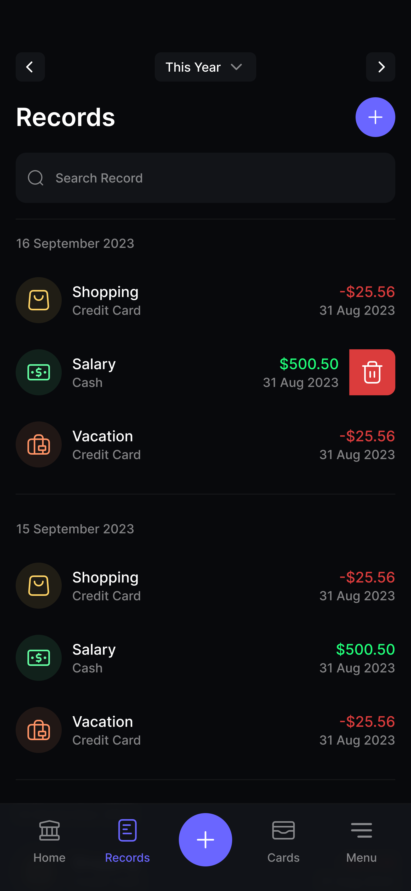

## UC05 - Visualizar Histórico pelo Painel Inicial

**Autor:** Usuário.
**Descrição:** Permite ao usuário acessar e visualizar o histórico completo de transações diretamente do painel inicial.  
**Pré-condições:** Usuário autenticado e existência de transações registradas.  
**Pós-condições:** Histórico de transações exibido com opções de filtro e ordenação.

**Fluxo Principal:**

1. No painel inicial, usuário clica em "Ver histórico completo" ou desliza a lista de transações recentes.
2. Sistema exibe tela de histórico com lista completa de transações em ordem cronológica inversa.
3. Usuário pode aplicar filtros por período, tipo ou categoria.
4. Sistema atualiza a lista conforme filtros aplicados.

**Fluxos Alternativos:**

- **Busca por texto:** O usuário utiliza a barra de pesquisa para digitar o nome de um estabelecimento ou descrição específica, filtrando a lista independentemente das opções de categoria ou período.

**Fluxos de Exceção:**

- Nenhuma transação encontrada para os filtros: sistema exibe mensagem "Nenhum resultado".
- Falha ao carregar histórico: sistema exibe erro e botão para recarregar.

**Imagem do Protótipo**

{: width="250" .center }

[Clique aqui para ver o protótipo completo.](../../entregas/prototipo.md)

---

