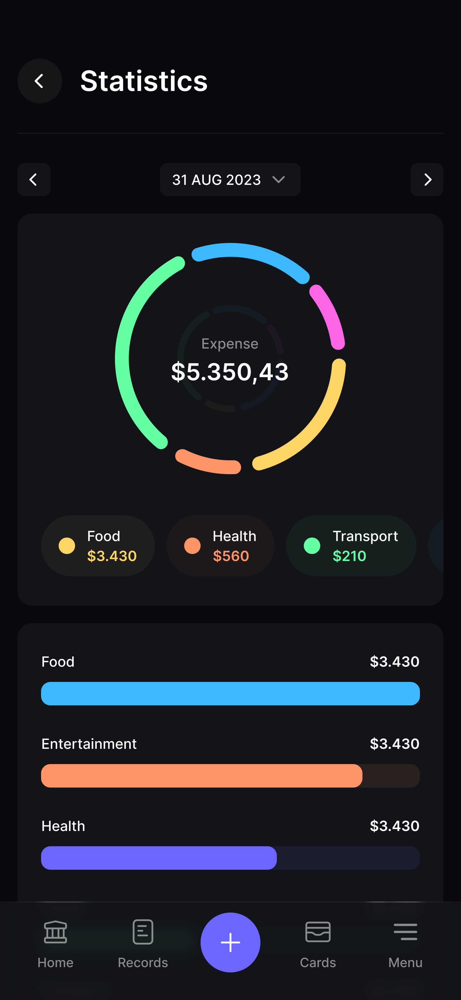

## UC06 - Visualizar Painel com Resumo Gráfico

**Autor:** Usuário.
**Descrição:** Exibe painel financeiro consolidado com um resumo gráfico interativo.  
**Pré-condições:** Usuário autenticado.  
**Pós-condições:** Painel com gráficos exibido, apresentando saldo, receitas, despesas e distribuição por categorias.

**Fluxo Principal:**

1. Acessa o dashboard ou área de relatórios visuais.
2. Define filtros de período, se necessário.
3. Sistema gera e exibe gráficos: saldo total, receitas vs despesas, gastos por categoria.
4. Usuário interage com os gráficos (tooltips, zoom, cliques).

**Fluxos Alternativos:**

- Não existe

**Fluxos de Exceção:**

- Nenhum dado disponível: sistema exibe painel vazio com mensagem orientativa.
- Período sem movimentações: sistema informa ausência de dados para o período.

**Imagem do Protótipo**

{: width="250" .center }

[Clique aqui para ver o protótipo completo.](../../entregas/prototipo.md)

---

