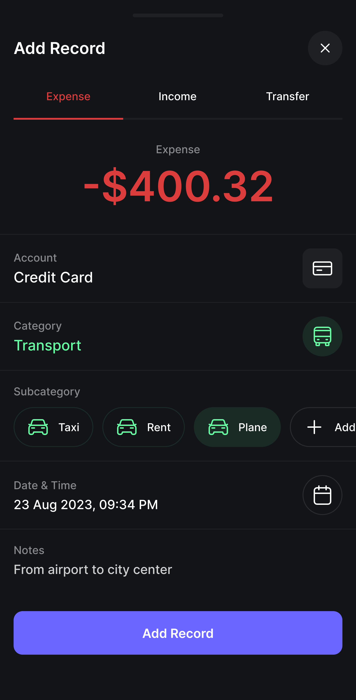
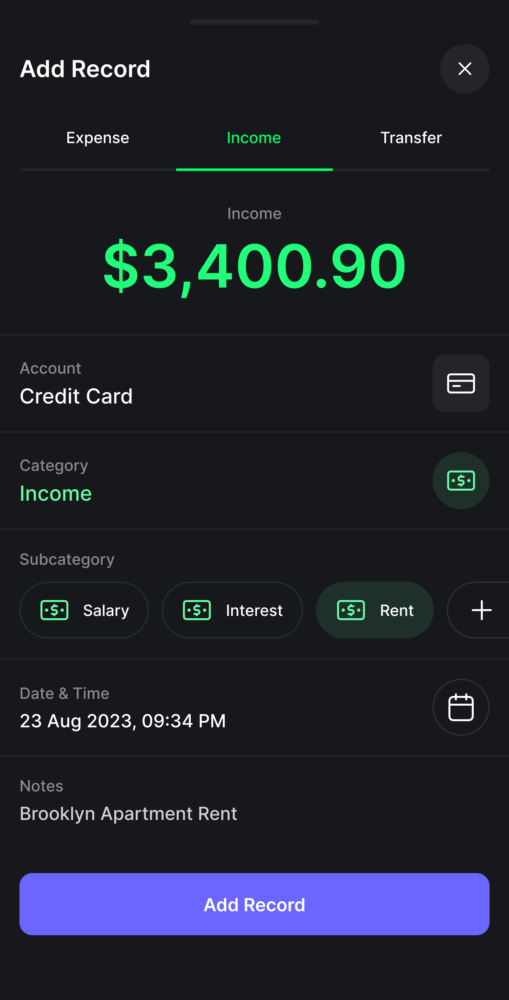

## UC07 - Registrar Transação

**Autor:** Usuário.
**Descrição:** Permite registrar entradas (receitas) ou saídas (despesas) de dinheiro.  
**Pré-condições:** Usuário autenticado.  
**Pós-condições:** Transação registrada e saldo atualizado.

**Fluxo Principal:**

1. Acessa a função "Nova transação".
2. Informa os dados: valor, tipo (receita/despesa), categoria e data.
3. Confirma o registro e o sistema salva.
4. Saldo é atualizado.

**Fluxos Alternativos:**

- Não existe

**Fluxos de Exceção:**

- Dados incompletos, campos vazios ou valores inválidos: sistema exibe erro.
- Sem conexão com internet: transação é salva offline e sincronizada posteriormente.

**Imagem do Protótipo**

{: width="250" }
{: width="250" }
{: .img-row }

[Clique aqui para ver o protótipo completo.](../../entregas/prototipo.md)

---

