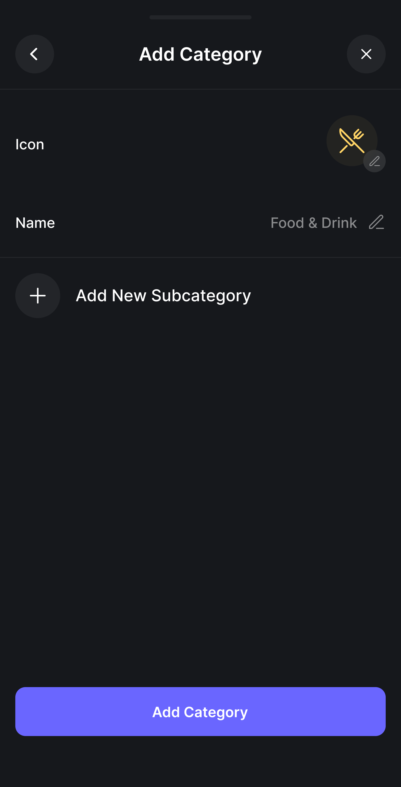

## UC10 - Criar Categoria de Transação

**Autor:** Usuário.
**Descrição:** Permite ao usuário criar uma nova categoria personalizada para classificar suas transações.  
**Pré-condições:** Usuário autenticado.  
**Pós-condições:** Categoria criada e disponível para uso em transações.

**Fluxo Principal:**

1. Acessa as configurações de categorias e seleciona "Nova categoria".
2. Informa o nome da categoria e, opcionalmente, escolhe um ícone ou cor.
3. Confirma a criação e o sistema valida.
4. Sistema salva a nova categoria e a disponibiliza na lista.

**Fluxos Alternativos:**

- - **Criar categoria inline:** Durante o preenchimento, o usuário nota que a categoria desejada não existe e seleciona "Nova Categoria", criando-a diretamente no fluxo do formulário sem perder os dados já inseridos.

**Fluxos de Exceção:**

- Nome de categoria já existente: sistema exibe erro e sugere outro nome.
- Nome vazio ou inválido: sistema solicita preenchimento correto.

**Imagem do Protótipo**

{: width="250" }
{: width="250" }
{: .img-row }

[Clique aqui para ver o protótipo completo.](../../entregas/prototipo.md)

---

