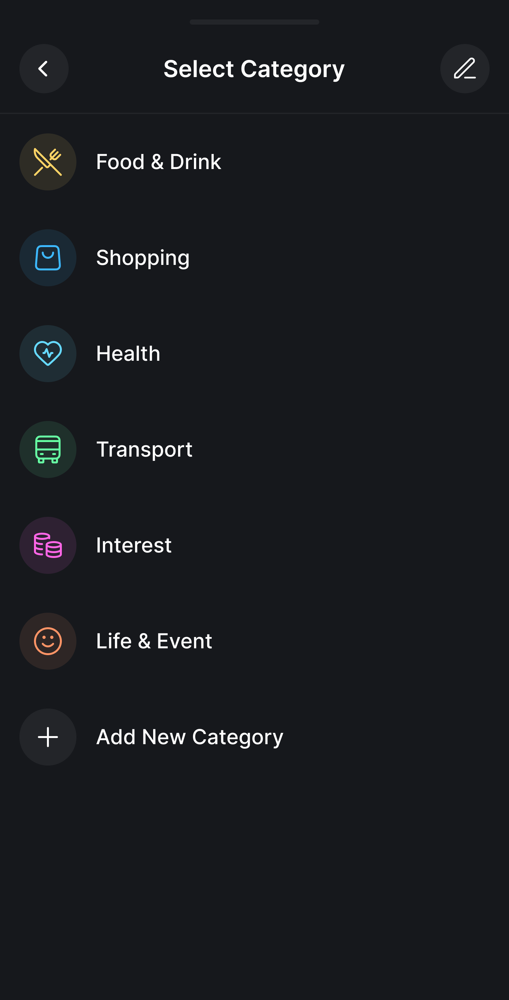
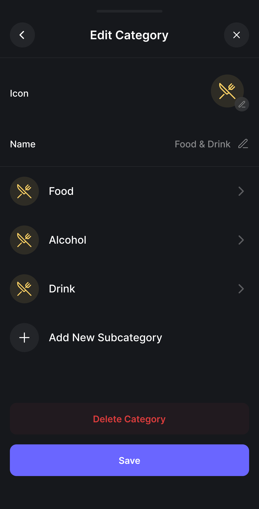

## UC12 - Apagar Categoria de Transação

**Autor:** Usuário.
**Descrição:** Permite ao usuário remover uma categoria personalizada do sistema.  
**Pré-condições:** Usuário autenticado e categoria a ser excluída não pode ser padrão do sistema.  
**Pós-condições:** Categoria removida; transações associadas são movidas para categoria padrão ou solicitam reclassificação.

**Fluxo Principal:**

1. Acessa a lista de categorias e seleciona a categoria.
2. Clica em "Excluir" e o sistema verifica se há transações vinculadas.
3. Sistema alerta sobre transações que serão desvinculadas e solicita confirmação.
4. Usuário confirma e o sistema remove a categoria.

**Fluxos Alternativos:**

- **Exclusão em cascata:** O sistema oferece a opção "Apagar categoria e todas as transações vinculadas", permitindo que o usuário limpe de uma só vez a classificação e o histórico atrelado a ela.

**Fluxos de Exceção:**

- Categoria com transações vinculadas: sistema oferece opção de reclassificar para outra categoria.
- Tentativa de excluir categoria padrão: sistema bloqueia a ação.
- Usuário cancela: categoria mantida.

**Imagem do Protótipo**

{: width="250" }
{: width="250" }
{: .img-row }

[Clique aqui para ver o protótipo completo.](../../entregas/prototipo.md)

---

