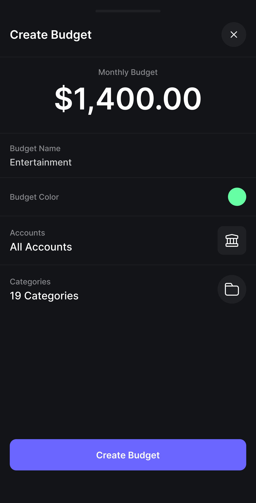

## UC16 - Criar Orçamento

**Autor:** Usuário.
**Descrição:** Permite criar objetivos financeiros e definir metas/limites de gastos mensais.  
**Pré-condições:** Usuário autenticado.  
**Pós-condições:** Planejamento e meta registrados no sistema.

**Fluxo Principal:**

1. Acessa a área de metas ou planejamento.
2. Define o valor/prazo da meta e os limites de gastos por categoria.
3. Sistema salva o registro e inicia o acompanhamento do progresso.

**Fluxos Alternativos:**

- Não existe

**Fluxos de Exceção:**

- Dados ou valores informados são inválidos: sistema exibe erro.

**Imagem do Protótipo**

{: width="250" }
{: width="250" }
{: .img-row }

[Clique aqui para ver o protótipo completo.](../../entregas/prototipo.md)

---

