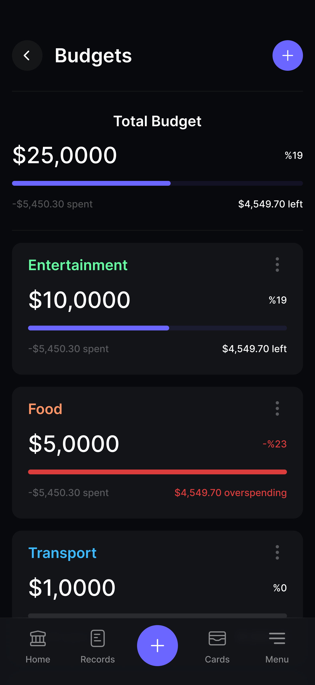
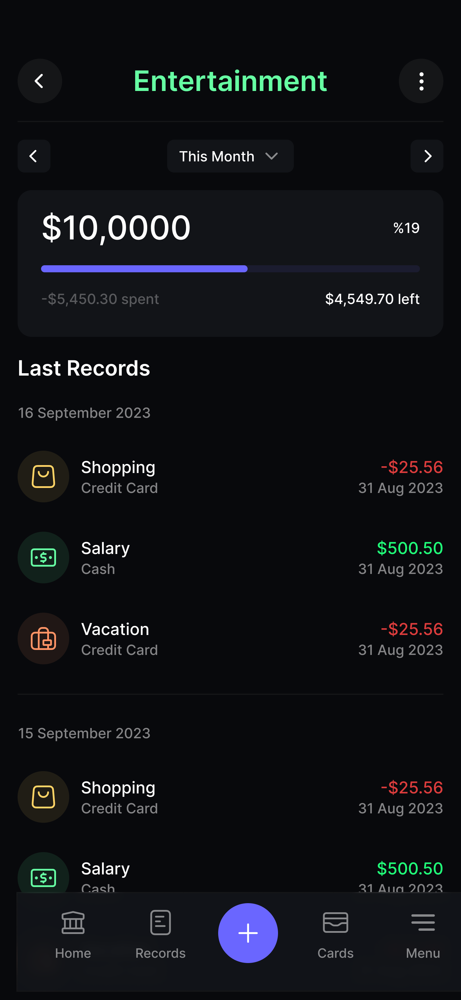
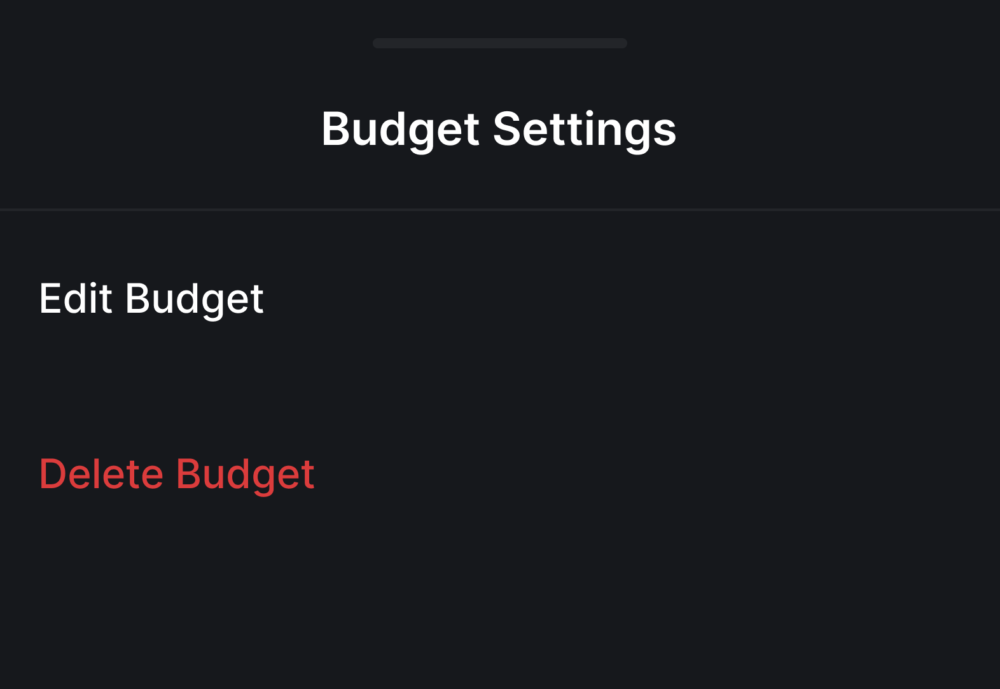

## UC18 - Apagar Orçamento

**Autor:** Usuário.
**Descrição:** Permite ao usuário remover um planejamento financeiro ou meta do sistema.  
**Pré-condições:** Usuário autenticado e existência de meta ou orçamento.  
**Pós-condições:** Planejamento removido e dados de progresso excluídos.

**Fluxo Principal:**

1. Acessa a lista de metas/orçamentos e seleciona o item.
2. Clica em "Excluir" e o sistema solicita confirmação.
3. Usuário confirma e o sistema remove o registro.

**Fluxos Alternativos:**

- Não existe

**Fluxos de Exceção:**

- Usuário cancela: item mantido.
- Erro ao excluir: sistema exibe mensagem de falha.

**Imagem do Protótipo**

{: width="250" }
{: width="250" }
{: width="250" }
{: .img-row }

[Clique aqui para ver o protótipo completo.](../../entregas/prototipo.md)

---

